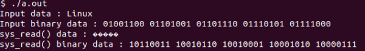
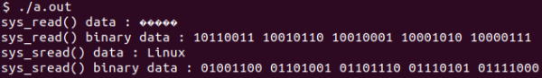

# OS Works

파일을 암호화해서 file write, file read 하는 Linux custom system call을 작성해보자.  

## Spec

swrite : `0010100101` -> binary conversion으로 `1101011010` 이렇게 암호화하는 system call

sread : `1101011010` -> binary conversion으로 `0010100101` 이렇게 복호화하는 system call

## Usage
### How to Use 1 - install requirements
`sudo wget https://cdn.kernel.org/pub/linux/kernel/v5.x/linux-5.5.16.tar.xz`  
`sudo xz -d linux-5.5.16.tar.xz`  
`sudo tar xvf linux-5.5.16.tar`  
`sudo apt update`  
`sudo apt install build-essential libncurses5 libncurses5-dev bin86 kernel-package libssh-dev bison flex libelf-dev`  
### How to Use 2 - build kernel
`cd linux-5.5.16/`  
`sudo cp -v /boot/config-$(uname -r) .config`  
`sudo scripts/config --disable SYSTEM_REVOCATION_KEYS`  
`sudo scripts/config --disable SYSTEM_TRUSTED_KEYS`  
`sudo make menuconfig`  
`sudo make -j2` (2 is your CPU's core number : can be replaced)  
`sudo make modules_install`  
`sudo make install`    
`sudo uname -a`  
`sudo reboot`  
`sudo uname -a`  
### How to Use 3 - edit and add files
edit `syscall_64.tbl`, `syscalls.h`, `Makefile`, `read_write.c` files.  
add `hello.c`, `test_hello.c`, `test_sread.c`, `test_swrite.c` files.  
`sudo make bzImage –j2`  
`sudo cp arch/x86/boot/bzImage /boot/vmlinuz-5.5.16`  
`sudo reboot`(You have to do reboot in order to implement the changes)  
### How to Use 4 - test custom system kernels
`sudo gcc -o test_hello test_hello.c`  
`sudo gcc -o test_sread test_sread.c`  
`sudo gcc -o test_swrite test_swrite.c`  
`sudo ./test_hello`   
`sudo ./test_sread`  
`sudo ./test_swrite`  
 
## Result
### test_swrite
  
### test_sread
  

## Source code
### 1. linux system call - read, write

```c
SYSCALL_DEFINE3(read, unsigned int, fd, char __user *, buf, size_t, count)
{
	return ksys_read(fd, buf, count);
}

ssize_t ksys_read(unsigned int fd, char __user *buf, size_t count)
{
	struct fd f = fdget_pos(fd);
	ssize_t ret = -EBADF;

	if (f.file) {
		loff_t pos, *ppos = file_ppos(f.file);
		if (ppos) {
			pos = *ppos;
			ppos = &pos;
		}
		ret = vfs_read(f.file, buf, count, ppos);
		if (ret >= 0 && ppos)
			f.file->f_pos = pos;
		fdput_pos(f);
	}
	return ret;
}
```
```c
SYSCALL_DEFINE3(write, unsigned int, fd, const char __user *, buf, size_t, count)
{
	return ksys_write(fd, buf, count);
}

ssize_t ksys_write(unsigned int fd, const char __user *buf, size_t count)
{
	struct fd f = fdget_pos(fd);
	ssize_t ret = -EBADF;

	if (f.file) {
		loff_t pos, *ppos = file_ppos(f.file);
		if (ppos) {
			pos = *ppos;
			ppos = &pos;
		}
		ret = vfs_write(f.file, buf, count, ppos);
		if (ret >= 0 && ppos)
			f.file->f_pos = pos;
		fdput_pos(f);
	}

	return ret;
}
```

### 2. linux system call - sread, swrite

```c
ssize_t ksys_sread(unsigned int fd, char __user *buf, size_t count){
	struct fd f = fdget_pos(fd);
	ssize_t ret = -EBADF;
	int i;

	if (f.file){
		loff_t pos, *ppos = file_ppos(f.file);
		if(ppos){
			pos = *ppos;
			ppos = &pos;
		}
		ret = vfs_read(f.file, buf, count, ppos);
		for(i=0;buf[i];i++) buf[i]=~buf[i];
		if(ret>=0 && ppos)
			f.file->f_pos=pos;
		fdput_pos(f);
	}
	return ret;
}

SYSCALL_DEFINE3(sread, unsigned int, fd, char __user *, buf, size_t, count){
	return ksys_sread(fd, buf, count);
}
```
```c
ssize_t ksys_swrite(unsigned int fd, char __user *buf, size_t count){
	struct fd f = fdget_pos(fd);
	ssize_t ret = -EBADF;
	int i;

	if (f.file){
		loff_t pos, *ppos = file_ppos(f.file);
		if(ppos){
			pos = *ppos;
			ppos = &pos;
		}
		for(i=0;i<count;i++) buf[i]=~buf[i];
		ret = vfs_write(f.file, buf, count, ppos);
		if(ret>=0 && ppos)
			f.file->f_pos=pos;
		fdput_pos(f);
	}
	return ret;
}

SYSCALL_DEFINE3(swrite, unsigned int, fd, char __user *, buf, size_t, count){
	return ksys_swrite(fd, buf, count);
}

```

